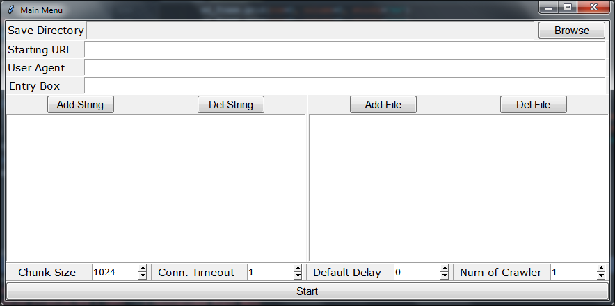
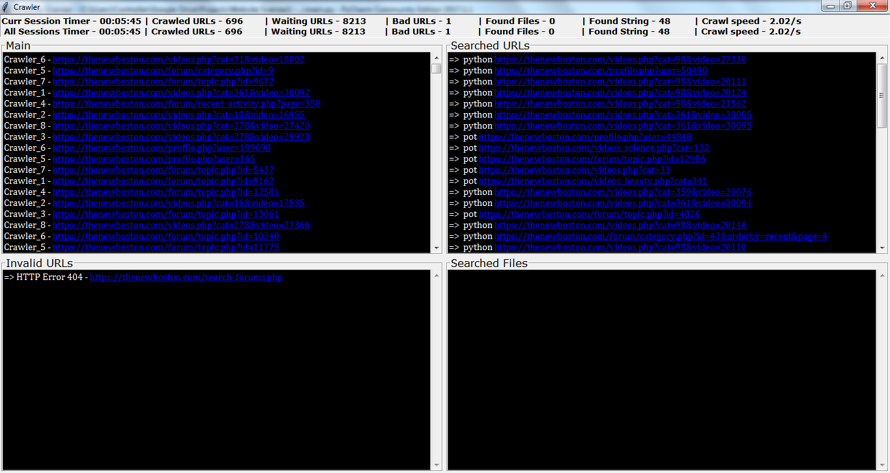

# Website-Scanner
Website Scanner can scan a website for broken links and search for specific strings and/or files with the help of multiple concurrently running web crawlers.

## Features:
  *	GUI based.
  *	AutoSaves progress every 2 minutes.
  *	Extracts and saves domain registration information of the site.
  *	Left Click any URL shown in output to open it and Right Click to copy it.
  *	Activity Logging
  *	Automatically download searched file.
  *	Downloading can be resumed if supported by the site.
  *	Multiple instances support.
  *	Shows warning when an instance tries to start a project which is already run by another instance.
  *	Shows Current Session and All Sessions statistics.
  *	Four output panes in can be resized by user.
  *	Waits for all crawlers to stop before exit.

## Software Requirements
  *	Python 3 - External libraries required:
    *	Requests - Requests allows you to send HTTP/1.1 requests.
    *	bs4 - Beautiful Soup sits atop an HTML or XML parser, providing Pythonic idioms for iterating, searching, and modifying the parse tree.
    *	validators - Python Data Validation for Humans™.
    *	robotexclusionrulesparser - A robots.txt parser for python.
    *	tld - Extract the top level domain (TLD) from the URL given.
    *	python-whois - Whois querying and parsing of domain registration information.

## Hardware Requirements
  *	Must be connected to internet.
  *	Must have enough space to store the data files and requested files. (Space required depends on the website which is to be scanned and options selected by user.)

## How to run
```bash
# clone repo
git clone https://github.com/rishabhsingh971/Website-Scanner.git
# change directory
cd Website-Scanner
# install pipenv
pip install --user --upgrade pipenv
# install environment
pipenv install
# run shell
pipenv shell
# run program
python main.py
```

## Input
&nbsp;
- **Save Directory** - directory in which data is saved
- **Start Url** - homepage of website
- **User Agent** - name of bot (will be used to find if sites gives access to user or not as per robots.txt)
- **Search String** - search string in a webpage
- **Search File** - search in file name of files stored on website
- **Chunk Size** - chunk of data requested per iteration when files are downloading given that site supports resume header
- **Connection Timeout** - if no response is received from website within this time, timeout error will be raised
- **Default Delay** - if website defines no rule for crawling time delay(in robots.txt), default delay given will be used
- **Number of Crawlers** - number of concurrently running crawlers.

## Output
&nbsp;
- **Current Session Statistics**: It consists of timer, number of crawled urls, number of waiting urls, number of bad/invalid urls number of files found, and number of strings found in current session only.
- **All Sessions Statistics**: It consists of timer, number of crawled urls, number of waiting urls, number of bad/invalid urls, number of files found, and number of strings found until that time.
- **Main Window**: Shows current urls crawling and other status.
- **Searched String Window**: Shows searched string with URL of page on which they are found.
- **Invalid urls window**: Shows Invalid urls found on website with error.
- **Searched files window**: Shows searched file with URL of page on which they are found.

## Code
Website Scanner comprises of following files:-
- [main.py](main.py) – contains MainMenu class that takes input from user.
- [file_func.py](file_func.py) – contains file related functions.
- [crawler_files.py](crawler_files.py) – contains CrawlerFiles class that has info about the data files of scanner and functions to read/write them.
- [url_func.py](url_func.py) – contains URL related functions.
- [scrolled_link.py](scrolled_link.py) – contains ScrolledLinks class which is a scrollable text box in which links are automatically formatted.
- [timer.py](timer.py) – contains a Timer class.
- [crawler.py](crawler.py) – contains Crawler class which crawls a website.
- [website_scanner.py](website_scanner.py) – contains a WebsiteScanner class which utilizes multiple crawlers to crawl website with the help of multithreading.

## Future
- Command Line Interface support.
- Help and usage file.
- Option to select type of search case sensitive or insensitive.
- Option to only store links of searched file, not download automatically.
- Option to pause/resume/stop file download.
- Option to recheck invalid urls.
- Option to restrict crawl depth.
- Option to exclude certain parts of website e.g. https://abc.com/forums/*.
- Option to set log file settings.
- Regex mode for searching and exclusion.
